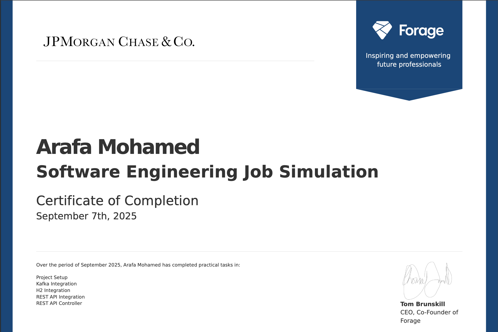

# Midas
Project repo for the JPMC Advanced Software Engineering Forage program

This repository contains my work for the **JPMC Forage Midas Virtual Experience Program**.  
The program simulates real-world tasks involving distributed systems, Kafka, Spring Boot, and REST APIs.

---

## 📂 Project Structure
- **Task 1–5**: Implementing and extending the Midas Core application  
- **Kafka integration**: Producer/consumer setup  
- **REST API**: Exposed user balance endpoint  
- **Unit tests**: Automated tests to verify functionality  

---

## 🚀 Technologies Used
- Java 17
- Spring Boot
- Apache Kafka
- Maven
- JUnit

---

## 📜 Certificate of Completion

I successfully completed the **JPMC Forage Midas Virtual Experience Program**.  

---

## 🔗 About the Program
Forage is a platform that provides free job simulations designed by leading companies.  
This project was completed as part of the **JPMorgan Chase Midas Virtual Internship Simulation**.
